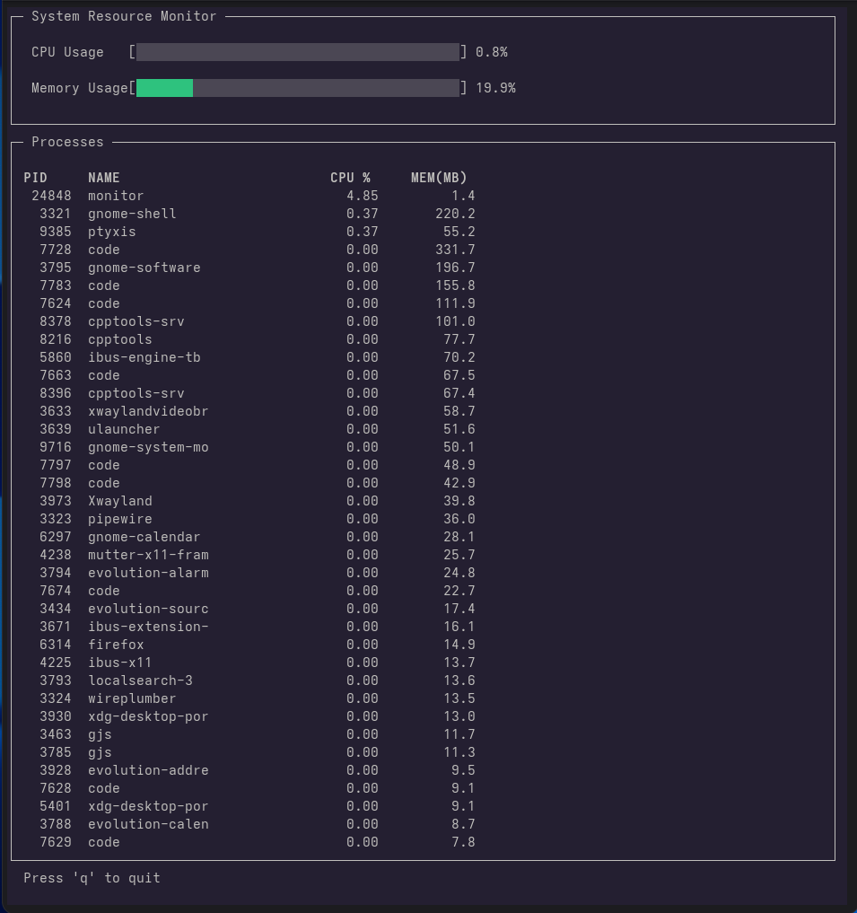

# System Resource Monitor (CLI Application)



## Overview

System Resource Monitor is a **terminal-based system monitoring tool written in C++**.
It provides **real-time insights into system performance** including CPU usage, memory consumption, and running processes directly inside the terminal.

The application reads system statistics from the **Linux `/proc` virtual filesystem** and displays them through a responsive **ncurses-based terminal interface**.

This project demonstrates **systems programming concepts**, interaction with **Linux kernel interfaces**, and building **interactive CLI applications**.

---

# Features

## Core Features

* Real-time **CPU usage monitoring**
* **Memory usage monitoring**
* Display of **running processes**
* Periodic automatic refresh
* Lightweight **terminal-based interface**

## User Interface Features

* Terminal UI built using **ncurses**
* Smooth refresh with minimal flicker
* Colored terminal output
* CPU and Memory **usage progress bars**
* Tabular display of processes
* Keyboard interaction (`q` to quit)

---

# Technologies Used

* **C++17**
* **ncurses / ncursesw** (terminal UI)
* Linux **/proc filesystem**
* **POSIX system interfaces**

---

# Direct Kernel Interface

The application reads system information directly from the Linux **`/proc` virtual filesystem**.

| File                       | Purpose                | Metric Derived              |
| -------------------------- | ---------------------- | --------------------------- |
| `/proc/stat`               | Aggregate CPU jiffies  | Total System CPU Load       |
| `/proc/meminfo`            | System-wide memory     | Used vs Available RAM       |
| `/proc/[pid]/stat`         | Process jiffies        | Per-Process CPU %           |
| `/proc/[pid]/comm`         | Process identification | Process Name                |
| `/proc/[pid]/smaps_rollup` | Memory summary         | PSS (Proportional Set Size) |

Using `/proc` allows the program to access **kernel-maintained system statistics** without external monitoring libraries.

---

# Project Structure

```
System_Resource_Monitor/
│
├── Makefile
├── README.md
│
├── include/
│   ├── cpu.h
│   ├── memory.h
│   ├── process.h
│   └── ui.h
│
└── src/
    ├── main.cpp
    ├── cpu.cpp
    ├── memory.cpp
    ├── process.cpp
    └── ui.cpp
```

---

# How It Works

## CPU Usage

CPU statistics are read from:

```
/proc/stat
```

The program reads CPU counters twice with a short delay and calculates the **percentage of active CPU time** using the difference between total and idle jiffies.

---

## Memory Usage

Memory statistics are obtained from:

```
/proc/meminfo
```

Used memory is calculated as:

```
Used Memory = MemTotal - MemAvailable
```

This reflects the **actual memory available to applications**, accounting for Linux caching behavior.

---

## Process Listing

Running processes are detected by scanning directories inside:

```
/proc
```

Each process directory contains metadata including:

* Process ID
* Process name
* CPU usage
* Memory usage

Processes are **sorted by CPU usage and memory consumption** before being displayed in the interface.

---

# Installation

This project is designed for **Linux systems**.

## Install Dependencies

### Fedora

```
sudo dnf install ncurses-devel
```

### Ubuntu / Debian

```
sudo apt install libncurses5-dev libncursesw5-dev
```

---

# Build Instructions

### Using Makefile (Recommended)

Compile the project by running:

```
make
```

This will generate the executable:

```
bin/sys_monitor
```

### Manual Compilation

You can also compile manually using:

```
g++ src/*.cpp -Iinclude -lncursesw -std=c++17 -o sys_monitor
```

---

# Run the Program

If built using the Makefile:

```
./bin/sys_monitor
```

If compiled manually:

```
./sys_monitor
```

Press **`q`** to exit the application.

---

# Example Output

```
SYSTEM RESOURCE MONITOR

CPU Usage   : [##############      ] 35%
Memory Usage: [################    ] 48%

PID        PROCESS                CPU%      MEM(MB)
1          systemd                0.3       12
210        bash                   0.1       4
912        chrome                 12.7      350
1201       code                   3.4       210
```

---

# Design Decisions

## Modular Architecture

The system is divided into independent modules:

* **CPU module** – CPU statistics
* **Memory module** – memory metrics
* **Process module** – process discovery and statistics
* **UI module** – terminal rendering

This improves **maintainability, readability, and scalability**.

---

## Direct Linux Kernel Interface

The program reads system information directly from the **Linux `/proc` filesystem** rather than relying on high-level monitoring libraries.

Advantages:

* deeper understanding of **Linux internals**
* **minimal dependencies**
* efficient access to system metrics

---

## Terminal UI with ncurses

The `ncurses` library provides:

* screen control
* color support
* keyboard input handling
* smooth screen refresh

This enables a **real-time interactive system dashboard inside the terminal**.

---

# Future Improvements

Possible enhancements include:

* Interactive **process sorting**
* Scrollable process list
* Process filtering and search
* Process tree visualization
* Interactive process management (kill / signals)

---

# License

This project is released under the **MIT License**.
